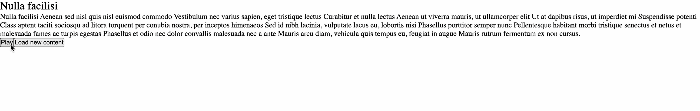

## Project Overview

Text to speech web app with indications for the current reading sentence, as well as the ability to highlight the currently playing word.

It retrieves the SSML from an API (provided), synthesize it into sentences, and use speech engine to implement the playback and UI.

## Setup

-   Clone the repository and run `npm install` to install the dependencies.
-   Run `npm run dev` to start the client development server.
-   Run `npm run dev:server` to start the API server.

### API

-   The code for the API is in the `api` directory. This piece is basically responsible for sending a random response from the array defined in `data.js`.
-   The api returns a response in form of a JSON object containing contents. The content string is in form of a subset of SSML that is defined later here.

### React App

-   The project is a basic react app, and such should come with all of the standard built ins of react.
-   Core logic for the project is hosted in `lib` folder.
-   `content.ts` file in the lib folder is responsible for fetching and parsing content into sentences.
-   `speech.ts` file contains an implementation for speech engine using the local window.speechSynthesis API.
-   `useSpeech.ts` reactifies the speech engine implementation and returns the controls for playback and gives information about the currently spoken word and sentence.

### Running Project Example

